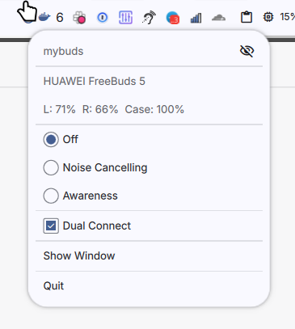

# MyBuds

<p align="center">
  
</p>

Desktop manager for Huawei FreeBuds and HONOR Earbuds headphones on Linux. Built with Rust.

<p align="center">

</p>

Based on [OpenFreebuds](https://github.com/melianmiko/OpenFreebuds) by melianmiko.

## Screenshots

<p align="center">
  
  
</p>

## Features

- **GUI** (GTK4 / Libadwaita) and **TUI** (Ratatui) interfaces
- **System tray** integration with battery indicator, ANC quick switch, and Dual Connect toggle
- ANC mode switching (Normal / Cancellation / Awareness / Adaptive)
- Battery monitoring (global + per-earbud + case)
- Equalizer presets
- Gesture customization (double tap, triple tap, long tap, swipe)
- Dual-device connection management with visual device cards
- Auto-pause, low latency, sound quality preferences
- Auto-reconnect with exponential backoff
- Desktop notifications

## Supported Devices

| Feature | Pro 3 / Pro 4 / FreeClip | Pro 2 / Pro | 5i | 6i | 4i / HONOR Earbuds 2 | SE 2 | 5 |
|---|:---:|:---:|:---:|:---:|:---:|:---:|:---:|
| Battery | :white_check_mark: | :white_check_mark: | :white_check_mark: | :white_check_mark: | :white_check_mark: | :white_check_mark: | :white_check_mark: |
| ANC | Full (dynamic) | Full (dynamic) | Cancel + Aware | Cancel + Aware | Basic | :x: | Cancel only |
| Equalizer | :white_check_mark: | :white_check_mark: | :white_check_mark: | :white_check_mark: | :x: | :white_check_mark: | :white_check_mark: |
| Double Tap | :white_check_mark: | :white_check_mark: | :white_check_mark: (L/R) | :white_check_mark: (L/R) | :white_check_mark: | :white_check_mark: (L/R) | :white_check_mark: (L/R) |
| Triple Tap | :x: | :x: | :white_check_mark: | :white_check_mark: | :x: | :white_check_mark: | :white_check_mark: |
| Long Tap | Split (ANC) | Split (ANC) | Split (ANC) | Split (ANC) | Basic | Hold | Split (ANC) |
| Swipe | :white_check_mark: | :white_check_mark: | :white_check_mark: | :white_check_mark: | :x: | :x: | :white_check_mark: |
| Auto Pause | :white_check_mark: | :white_check_mark: | :white_check_mark: | :white_check_mark: | :white_check_mark: | :x: | :white_check_mark: |
| Low Latency | :white_check_mark: | :white_check_mark: | :white_check_mark: | :white_check_mark: | :x: | :white_check_mark: | :white_check_mark: |
| Sound Quality | :white_check_mark: | :white_check_mark: | :white_check_mark: | :white_check_mark: | :x: | :x: | :white_check_mark: |
| Dual Connect | :white_check_mark: | :white_check_mark: | :white_check_mark: | :white_check_mark: | :x: | :x: | :white_check_mark: |

Connection: RFCOMM/SPP (Huawei proprietary protocol)

Devices not listed above will use a **generic probe** profile that attempts to detect available features automatically.

## Requirements

- Linux with BlueZ (Bluetooth stack)
- Paired Huawei FreeBuds or HONOR Earbuds
- GTK4 and Libadwaita (for GUI)
- D-Bus (for system tray / StatusNotifierItem)

## Building

```bash
cargo build --release
```

The binary will be at `target/release/mybuds`.

## Usage

```bash
# GUI mode (default)
mybuds

# Terminal UI mode
mybuds --tui
```

### Configuration

Config file: `~/.config/mybuds/config.toml`

```toml
device_address = "AA:BB:CC:DD:EE:FF"  # optional, auto-detected if omitted
device_name = "HUAWEI FreeBuds Pro 3"  # optional
auto_connect = true                     # reconnect automatically (default: true)
start_minimized = false                 # start in system tray (default: false)
```

### Logging

```bash
RUST_LOG=mybuds=debug mybuds
```

In TUI mode, logs are written to `/tmp/mybuds.log`.

## Architecture

```
src/
├── bluetooth/     # BlueZ connections (RFCOMM)
├── protocol/      # Wire protocol (Huawei SPP)
├── device/        # Feature handlers (ANC, battery, EQ, gestures)
│   └── models/    # Per-device profiles
├── ui/            # GTK4 / Libadwaita GUI (pages + widgets)
├── tui/           # Ratatui terminal UI
├── tray/          # System tray (ksni / StatusNotifierItem)
└── config/        # TOML app config
```

## Acknowledgments

- [OpenFreebuds](https://github.com/melianmiko/OpenFreebuds) by [melianmiko](https://github.com/melianmiko) — Huawei SPP protocol reverse-engineering

## License

See [OpenFreebuds](https://github.com/melianmiko/OpenFreebuds) for the original license terms.
